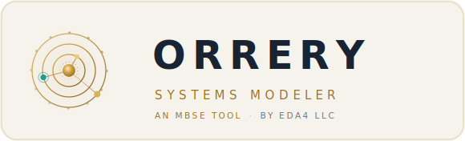

<p align="center">
  <picture>
    <source media="(prefers-color-scheme: dark)" srcset="docs/imagery/orrery_logo_dark.svg" />
    
  </picture>
</p>

# Orrery Systems Modeler — SysML / UML model server

[](https://github.com/erautiola/Orrery-Systems-Modeler/actions/workflows/ci.yml)
[](https://github.com/erautiola/Orrery-Systems-Modeler/actions/workflows/codeql.yml)


A server-based, multi-user UML & SysML modeling tool. Runs as a small Node.js
web server (packaged with Docker so it runs identically on Windows, Linux, Mac,
or any cloud). Everyone on your team points a browser at the same server and
works from one **shared project library**.

You can **author** models — create diagrams, drop elements, draw relationships,
edit properties — as well as **import** and **export** OMG XMI.

📚 **[Full documentation](docs/README.md)** — architecture, data model, flows,
requirements, and the REST API, with embedded UML & SysML (PlantUML) diagrams.

---

## Run it

You need Docker. From this folder:

```bash
docker compose up -d
```

Then open **http://localhost:8080** in a browser. Anyone who can reach that
machine on port 8080 shares the same projects.

- Stop: `docker compose down`
- Update after code changes: `docker compose up -d --build`
- Data (the project library) lives in the `modeler-data` Docker volume and
  survives restarts and upgrades.
- The host port is set in `docker-compose.yml` (`8080:8137`); change the left
  number if 8080 is taken.

### Without Docker

If you have Node 18+:

```bash
cd server && npm install && npm start      # serves on http://localhost:8137
```

Set `PORT` and `DATA_DIR` env vars to override the port and storage location.

---

## What you can do

**Projects (shared library)**
- **Open** — browse and open any project on the server.
- **New** — create an empty project.
- **Import XMI** — load a `.xmi`/`.xml`/`.uml` file (drag-drop works too); it
  becomes a new shared project, auto-laid-out and ready to edit.
- **Save** — writes back to the server. Saves are guarded by a revision number,
  so if someone else saved while you were editing you get a conflict warning
  instead of silently overwriting their work.
- **Export** — XMI (interoperate with EA / Papyrus / Cameo), SVG (current
  diagram), or raw model JSON.

**Authoring**
- Multiple diagrams per project, of these types:
  Class, Package, Component, **SysML BDD**, **SysML IBD**, **Requirement**,
  Use Case, **State Machine**, **Sequence**, **ER / Data Model**.
- **ER / Data Model**: database tables with columns (type, PK, NOT NULL, UNIQUE,
  default), foreign keys in **crow's-foot** notation, and **SQL DDL export**
  (`CREATE TABLE` + FK constraints) via Export → SQL DDL.
- **Sequence diagrams**: lifelines (with `represents` type), sync / async / reply
  / create / destroy messages, **self-messages**, **activation bars**, and
  `ret = op(args)` labels. Drag from one lifeline to another to add a message;
  drag a message up/down to reorder.
- **State Machine** support is deep: **composite states** with nested sub-states
  (drag elements in/out to nest/un-nest), **entry / exit / do** internal
  activities, transition **trigger [guard] / effect** labels, **self-transitions**,
  orthogonal-region dividers, and the **initial / final / choice / fork-join /
  junction / history** pseudostates.
- A **palette** per diagram type: click an element tool then click the canvas to
  place it; click a relationship tool then drag from source to target.
- Select, **drag to move**, **resize** (corner handles), and **delete** (Del).
- **Properties panel**: rename, toggle abstract, edit stereotypes; add/remove/edit
  attributes (visibility, type, multiplicity, default), operations (with
  parameters), enumeration literals, and requirement id/text. Edit relationship
  type, roles, and multiplicities.
- Proper notation: compartments, visibility markers (`+ - # ~`), inheritance
  triangles, aggregation/composition diamonds, dashed dependency/realization
  arrows, multiplicities, stereotypes, actors, use cases, states, etc.
- Pan (drag background), zoom (wheel), **Fit**, **Ctrl+S** to save.

**Tables & matrices** (left sidebar → *Tables & Matrices* → ＋)
- **Element table** — spreadsheet view of elements; pick a type filter, columns
  show name / type / stereotypes / attributes / operations; **name and
  stereotype cells are editable** and write straight back to the model.
- **Requirements table** — id, text, and which elements **satisfy** / **derive**
  each requirement (id & text editable).
- **Interface table** — interfaces / interface blocks with their operations and
  what realizes them.
- **Dependency matrix** — elements on rows × columns; **click a cell to
  create/remove** a relationship of the chosen type. Great for traceability.
- Every table/matrix has **Export CSV**.

---

## Architecture

```
server/
  server.js          Express: serves the SPA + REST API
  store.js           file-based shared project library (optimistic-concurrency saves)
  package.json / package-lock.json
public/              the browser app (no build step, framework-free)
  index.html
  css/styles.css
  js/model.js        internal model + UML/SysML type catalog (palettes, notation)
  js/xmi-parser.js   XMI → parser model
  js/xmi-import.js   parser model → internal model (+ auto-layout)
  js/xmi-export.js   internal model → XMI 2.1
  js/layout.js       force-directed auto-layout (for imports)
  js/renderer.js     SVG rendering of node/edge diagrams + handles
  js/seq-renderer.js bespoke renderer for sequence diagrams
  js/editor.js       canvas interaction: create/select/move/resize/connect
  js/api.js          REST client
  js/app.js          controller: projects, diagrams, tables, palette, properties
docs/                full docs + PlantUML UML/SysML diagrams (docs/diagrams/*.puml)
exports/             orrery-systems-modeler.xmi — the app's own model, importable
samples/*.xmi        example models you can Import
.github/             CI, CodeQL, dependency-review workflows + Dependabot
Dockerfile, docker-compose.yml
```

The browser holds the model and does XMI parsing/serialization; the server
stores the JSON model and serves the library. Storage is plain JSON files — easy
to back up (copy the volume) or inspect.

See **[docs/](docs/README.md)** for the architecture, data-model, behavior, and
API documentation (with rendered diagrams).

## Continuous integration & scanning

Every push / PR to `main` runs (see [`.github/workflows`](.github/workflows)):

- **CI** — installs deps (`npm ci`), syntax-checks all JS, runs `npm audit`, and
  builds the Docker image + a `/api/health` smoke test.
- **CodeQL** — static security/quality analysis for JavaScript (also weekly).
- **Dependency Review** — flags vulnerable dependency changes on PRs.
- **Dependabot** — weekly update PRs for npm, GitHub Actions, and Docker.

---

## Roadmap (not yet implemented)

This is a strong authoring foundation, but "all of UML/SysML" is a large surface.
Planned next phases (real-time co-editing is intentionally **out of scope** —
the model is *shared library, separate work*: everyone shares projects, saves are
conflict-checked):

- **Activity** and **Parametric** diagrams (Sequence and ER/SQL are done) — plus
  Timing & Communication.
- Accounts / permissions, model validation rules, undo-redo history, and richer
  IBD port/flow semantics.

---

<sub>**Orrery Systems Modeler** — an MBSE tool by **EDA4 LLC**.</sub>

