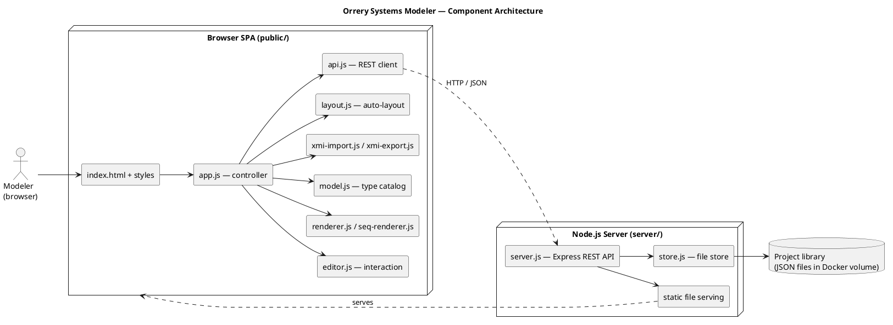
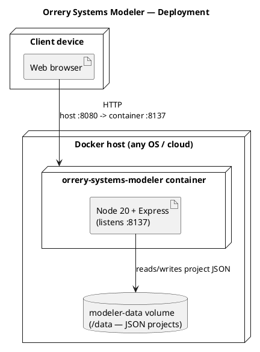
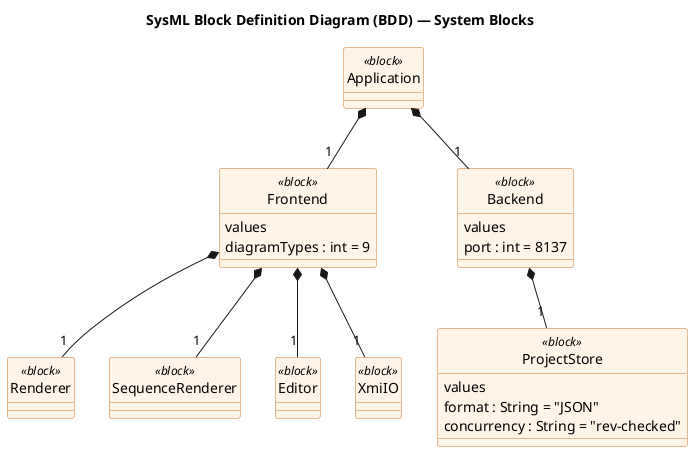

# Architecture

Orrery Systems Modeler is a framework-free browser SPA talking to a small
Node/Express server over a REST API. The server stores each project as a JSON
document in a shared library (a Docker volume). Everything ships in one Docker
image.

> **Rendering note.** Diagrams below are written in [PlantUML](https://plantuml.com).
> GitHub shows the rendered image via the public PlantUML proxy; the source is
> embedded under each *PlantUML source* dropdown and also lives in
> [`docs/diagrams/`](diagrams). To render locally: `plantuml docs/diagrams/*.puml`.

## Component architecture

PlantUML source

**Key points**

- The **browser holds the model** and does all parsing/serialization/rendering.
  The server is deliberately thin: serve static files + CRUD on JSON documents.
- **`model.js`** is the single source of truth for the UML/SysML *type catalog*
  (which elements/relationships each diagram type offers, and how they draw).
- Rendering is split: **`renderer.js`** for node-and-edge diagrams (class, BDD,
  state machine, …) and **`seq-renderer.js`** for sequence diagrams.

## Deployment

PlantUML source

The container listens on `8137`; `docker-compose.yml` publishes it on host
`8080`. The project library lives in the `modeler-data` named volume so data
survives restarts and image upgrades.

## SysML view — Block Definition Diagram

The same system, expressed as SysML blocks (Orrery dogfooding its own notation).

PlantUML source

> 💡 You can **import this system model into Orrery itself** — see
> [`exports/orrery-systems-modeler.xmi`](../exports/orrery-systems-modeler.xmi)
> (Import XMI → it opens as a SysML BDD with requirements).
