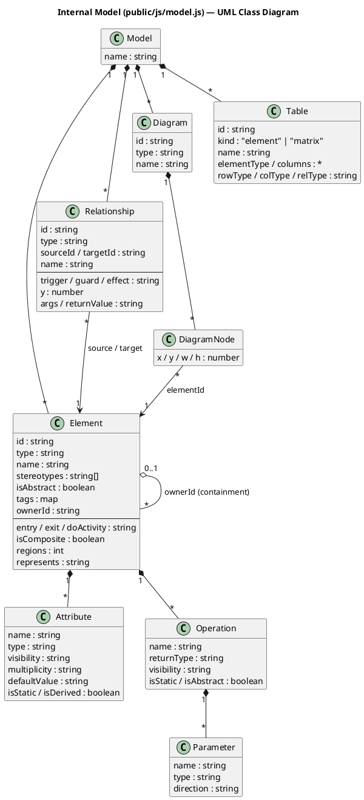
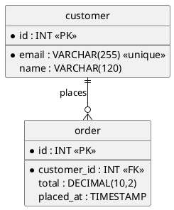

# Data Model

A *project* is one JSON document. Its `model` is the entire UML/SysML model plus
the diagrams and tables that view it. This is also the format persisted by the
server and produced by XMI import.

```
project = { id, name, rev, createdAt, updatedAt, model }
model   = { name, elements[], relationships[], diagrams[], tables[] }
```


<details><summary>PlantUML source</summary>


</details>

## Notes on the design

- **Elements are shared across diagrams.** A `Diagram` does not own elements; it
  holds `nodes` that *place* existing elements (by `elementId`) at an `x,y,w,h`.
  The same block can appear on several diagrams; tables and matrices read the
  same elements. Deleting an element removes it from the model and every diagram.
- **Containment** (`ownerId`) drives nested rendering — composite states and
  packages. For a nested node, its `x,y` are *relative to the parent's content
  origin*; the renderer accumulates absolute positions for edge routing.
- **Type‑specific fields** live on the generic `Element`/`Relationship`:
  state machines use `entry/exit/doActivity/isComposite/regions` and transition
  `trigger/guard/effect`; sequence diagrams use lifeline `represents` and message
  `y/args/returnValue`. The **type catalog** in `model.js`
  (`ELEMENTS`, `RELATIONSHIPS`, `DIAGRAMS`, `TABLES`) decides what is valid and
  how it draws.
- **Tables** are views, not data: an `element` table filters/renders elements
  into editable cells; a `matrix` reads/writes relationships of a chosen type.

## Database / ER tables (data modeling)

The **ER / Data Model** diagram type models relational schemas. A `dbtable`
element carries `columns` (`{ name, dataType, pk, nullable, unique, defaultValue }`)
instead of UML attributes, and a `fk` relationship (crow's-foot notation) links a
child table to its parent, carrying `fkColumn` / `refColumn`.


<details><summary>PlantUML source</summary>


</details>

**Export → SQL DDL** turns that into runnable DDL (PK / NOT NULL / UNIQUE /
DEFAULT, composite keys, FK constraints, and reserved-word quoting):

```sql
CREATE TABLE customer (
  id INT NOT NULL,
  email VARCHAR(255) NOT NULL UNIQUE,
  name VARCHAR(120),
  PRIMARY KEY (id)
);

CREATE TABLE "order" (
  id INT NOT NULL,
  customer_id INT NOT NULL,
  total DECIMAL(10,2),
  placed_at TIMESTAMP,
  PRIMARY KEY (id)
);

ALTER TABLE "order" ADD CONSTRAINT fk_order_1
  FOREIGN KEY (customer_id) REFERENCES customer (id);
```

SQL generation is covered by unit tests in `server/test/sql-export.test.js`.
