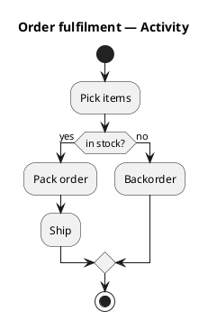
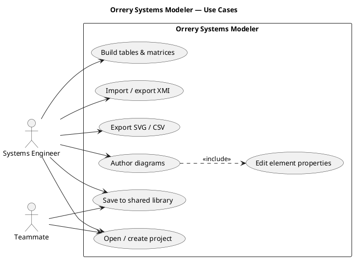
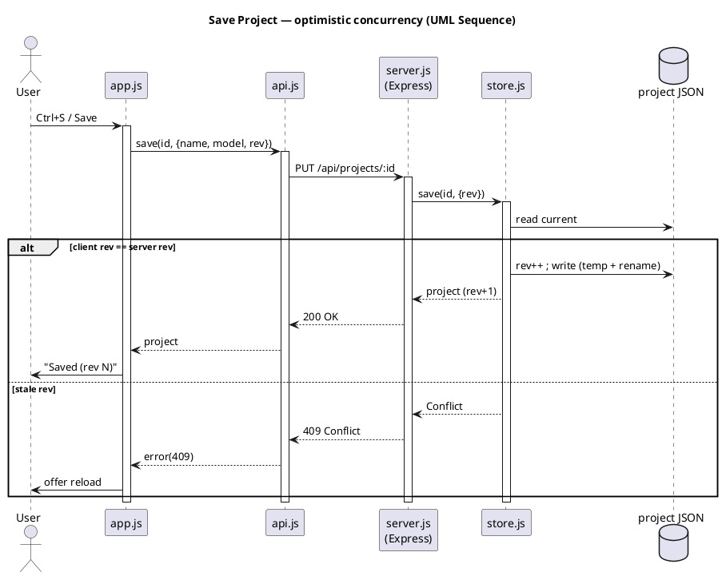
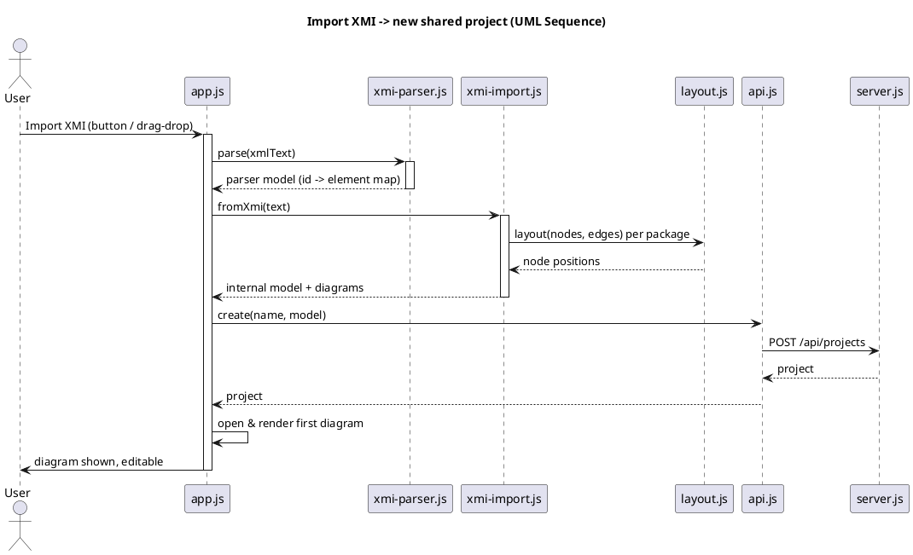
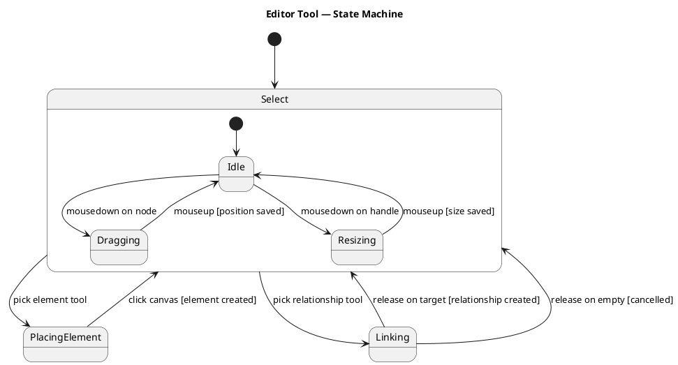

# Behavior & Flows

UML behavioral views of the key interactions. Sources in [`docs/diagrams/`](diagrams).

## Activity (example)

An Activity diagram models control flow through actions, decisions, and forks
(optionally grouped into swimlane partitions).

PlantUML source

## Use cases

PlantUML source

## Save project (optimistic concurrency)

Saves carry the `rev` the client started from. If another teammate saved in the
meantime, the server returns **409** instead of silently overwriting.

PlantUML source

## Import XMI

PlantUML source

## Editor tool — State Machine

PlantUML source

