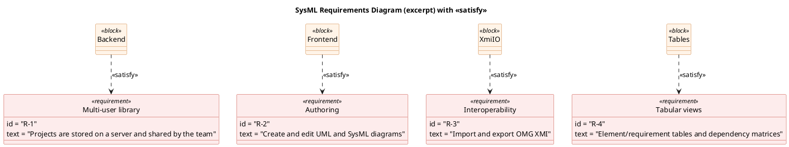

# Requirements (SysML)

A SysML requirements view of Orrery Systems Modeler, with `«satisfy»` links from
the blocks that fulfil them. This mirrors what the bundled
[`exports/orrery-systems-modeler.xmi`](../exports/orrery-systems-modeler.xmi)
contains, so you can import it and explore the same requirements inside the tool.

PlantUML source

## Requirement register

| ID  | Requirement | Satisfied by | Status |
|-----|-------------|--------------|--------|
| R-1 | Projects stored on a server and shared by the team | Backend / ProjectStore | ✅ done |
| R-2 | Create and edit UML & SysML diagrams | Frontend (editor + renderers) | ✅ done |
| R-3 | Import and export OMG XMI | XmiIO | ✅ done |
| R-4 | Element/requirement tables and dependency matrices | Tables | ✅ done |
| R-5 | Database/ER tables + SQL generation | Frontend (ER renderer + SQL export) | ✅ done |
| R-6 | Activity & Parametric diagrams | Frontend (renderers + editor) | ✅ done |
| R-7 | Timing & Communication diagrams | — | ⏳ planned |
