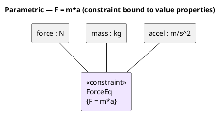

# User Guide

## Open the app

`docker compose up -d`, then browse to **http://localhost:8080**. Anyone who can
reach that host/port shares the same project library.

## Undo / redo

Every edit — creating, moving, resizing, connecting, deleting, property changes,
table/matrix edits, adding/removing diagrams — can be undone. Use the **↶ / ↷**
buttons in the top bar or **Ctrl+Z** / **Ctrl+Y** (also **Ctrl+Shift+Z** to redo).
A burst of typing in a field collapses into a single undo step. History is
per‑open‑project and resets when you open or create a project.

## Validation

Click **✓ Validate** in the top bar to check the model. Issues are grouped by
severity (**error / warning / info**) — e.g. unnamed elements, dangling
relationships, generalization cycles, empty enumerations, abstract types with no
subtypes, tables without a primary key, foreign keys that reference a missing
column, requirements missing id/text, and diagrams that reference deleted
elements. **Click any issue** to jump to and select the offending element.

## Appearance (light / dark)

Use the **☾ / ☀ button** in the top bar to switch between dark and light themes.
Your choice is remembered in the browser; first‑time visitors default to your OS
preference. Diagrams (including exported SVG colors on screen) follow the theme.

## Projects (shared library)

- **Open** — browse and open any project on the server.
- **New** — create an empty project (starts with one Class diagram).
- **Import XMI** — load a `.xmi`/`.xml`/`.uml` file (button or drag‑drop onto the
  canvas); it becomes a new shared project, auto‑laid‑out.
- **Save / Ctrl+S** — writes back to the server (rev‑checked; you're warned on a
  conflict instead of overwriting a teammate).
- **Export ▾** — XMI, SVG (current diagram), or model JSON.

## Workspace layout

The **left sidebar** has three tabs — **Diagrams**, **Tables** (tables &
matrices), and **Explorer** (the model tree) — plus the palette for the active
diagram. The main area shows **open views as tabs**: open several diagrams and
tables at once and switch between them with the tab strip above the canvas; the
✕ on a tab closes it (a dot marks which items are open in the sidebar lists).
Each diagram tab remembers its own pan/zoom.

**Model Explorer:** clicking an element **shows its Properties** and, if it's
placed on a diagram, focuses it there (opening/switching to that diagram) — it no
longer asks to drop it onto the current diagram.

## Diagrams

Add with **＋ New diagram** on the *Diagrams* tab. Types: Class, Package,
Component, SysML **BDD**, SysML **IBD**, **Requirement**, **Use Case**, **State
Machine**, **Sequence**, **ER / Data Model**, **Activity**, **Parametric**,
**Communication**, **Timing**.

- Pick an **element tool** in the palette, then click the canvas to place it.
- Pick a **relationship tool**, then **drag from source to target**.
- **Select** to move; drag a **corner handle** to resize; **Delete** to remove.
- Pan by dragging the background; **wheel** to zoom; **Fit** button to frame all.

### State machines
Composite states contain sub‑states — drop a state inside a composite, or drag
one in/out to (un)nest. Set `entry/exit/do` activities and **Composite**/regions
in Properties. Transitions show `trigger [guard] / effect`. Pseudostates:
initial, final, choice, fork/join, junction, history.

### Sequence diagrams
Place **Lifelines**; choose a message tool (sync/async/reply/create/destroy) and
**drag from one lifeline to another**. Drag a message up/down to reorder.
Self‑messages and activation bars are drawn automatically.

### ER / Data Model
Place **DB Table** elements; in Properties add **Columns** (name, type, and the
**PK / NOT NULL / UNIQUE** checkboxes + default). Use the **Foreign Key** tool to
drag from a child table to its parent (crow's‑foot notation); set the FK column
and referenced column in the relationship's Properties. Then **Export → SQL DDL
(.sql)** to generate `CREATE TABLE` + foreign‑key constraints.

### Activity
Place **Action**, **Decision/Merge**, **Fork/Join**, **Initial**, **Final**,
**Flow Final**, and **Object Node** elements, and connect them with **Control
Flow** (add a `[guard]` in Properties) or **Object Flow**. Drop a **Partition**
(swimlane) and drag actions into it to assign them to that lane.

### Internal Block (IBD) — from a block, ports & item flows
**Create an IBD from a block.** Model a block's structure in a **BDD** first —
add the child blocks and link them to the whole with **Composition** (or
**Aggregation**). Then create the block's internal view any of these ways:

- **Right‑click** the block (on the canvas *or* in the Model Explorer) → **Create
  IBD from block**; or
- select the block and use **⊞ Create IBD from this block** in Properties; or
- the **＋** *New diagram* dialog — choose type **Internal Block (IBD)**, then pick
  the **Owning block**.

A dialog lists the block's parts (each `role : Type [multiplicity]`, from its
composition/aggregation relationships plus any parts it already owns). **Check the
ones to import** and click **Create IBD**. The new diagram is drawn with the block
as a labelled **«block» boundary frame** and the chosen parts placed inside as
typed part elements. Blocks with no parts still create an empty IBD you can fill
in by hand.

Place **Part** elements. Drop a **Port** onto a part — it **snaps to the part's
border**; drop it on the **block boundary frame** (the labelled rectangle of an
IBD created from a block) and it snaps to that **boundary**. In the port's
Properties set its **direction** (in / out / inout, shown as a small triangle),
**flow type**, whether it's **conjugated** (`~`), or reassign it via **On part /
boundary** (which lists the parts and, on a block‑framed IBD, the enclosing block).
Connect ports with a **Connector**, or an **Item Flow** and set its **item name /
type** — the flow renders as `«flow» item : Type` with a directional arrow.
Parts imported from a block stay owned by it — moving them around the IBD keeps
them inside the block. **Selecting a block** (in a BDD or the Model Explorer)
lists its **Parts** and its **Ports** (boundary and nested) in Properties; click a
row to locate that part or port on a diagram.

### Parametric (SysML)
Place a **Constraint** (set its `{expression}` and list its **parameters** in
Properties) and **Value Property** elements (type + value). Use the **Binding
Connector** to tie value properties to the constraint's parameters.

### Communication
Place **Object** elements (`role:Class`, drawn underlined) and connect them with
the **Message** tool — a directed arrow. In Properties set the **sequence #**
(e.g. `1`, `1.1`) and the **message** text; the label renders as `1: doIt()`.

### Timing
Place a **Timeline**; each is a band with state lanes on the left and a step
function over a time axis. In Properties set the **time length**, the list of
**states**, and the **state changes** (each is an `at` time + a state). Bands
stack in creation order.

PlantUML source

## Tables & matrices

Add with the **＋** beside *Tables & Matrices*:

- **Element table** — pick a type filter; name/stereotype cells are editable.
- **Requirements table** — id, text, satisfy/derive columns.
- **Interface table** — interfaces/interface blocks with their operations.
- **Dependency matrix** — click a cell to create/remove a relationship.
- Every table/matrix has **Export CSV**.

## Try the bundled models

Import any of these (Import XMI):

- [`samples/library.xmi`](../samples/library.xmi) — a UML class model.
- [`samples/satellite.xmi`](../samples/satellite.xmi) — a SysML BDD with requirements.
- [`exports/orrery-systems-modeler.xmi`](../exports/orrery-systems-modeler.xmi) —
  Orrery's own architecture as a SysML model.
