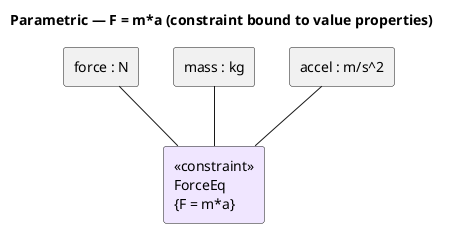

# User Guide

## Open the app

`docker compose up -d`, then browse to **http://localhost:8080**. Anyone who can
reach that host/port shares the same project library.

## Appearance (light / dark)

Use the **☾ / ☀ button** in the top bar to switch between dark and light themes.
Your choice is remembered in the browser; first‑time visitors default to your OS
preference. Diagrams (including exported SVG colors on screen) follow the theme.

## Projects (shared library)

- **Open** — browse and open any project on the server.
- **New** — create an empty project (starts with one Class diagram).
- **Import XMI** — load a `.xmi`/`.xml`/`.uml` file (button or drag‑drop onto the
  canvas); it becomes a new shared project, auto‑laid‑out.
- **Save / Ctrl+S** — writes back to the server (rev‑checked; you're warned on a
  conflict instead of overwriting a teammate).
- **Export ▾** — XMI, SVG (current diagram), or model JSON.

## Diagrams

Add with the **＋** beside *Diagrams*. Types: Class, Package, Component,
SysML **BDD**, SysML **IBD**, **Requirement**, **Use Case**, **State Machine**,
**Sequence**, **ER / Data Model**, **Activity**, **Parametric**.

- Pick an **element tool** in the palette, then click the canvas to place it.
- Pick a **relationship tool**, then **drag from source to target**.
- **Select** to move; drag a **corner handle** to resize; **Delete** to remove.
- Pan by dragging the background; **wheel** to zoom; **Fit** button to frame all.

### State machines
Composite states contain sub‑states — drop a state inside a composite, or drag
one in/out to (un)nest. Set `entry/exit/do` activities and **Composite**/regions
in Properties. Transitions show `trigger [guard] / effect`. Pseudostates:
initial, final, choice, fork/join, junction, history.

### Sequence diagrams
Place **Lifelines**; choose a message tool (sync/async/reply/create/destroy) and
**drag from one lifeline to another**. Drag a message up/down to reorder.
Self‑messages and activation bars are drawn automatically.

### ER / Data Model
Place **DB Table** elements; in Properties add **Columns** (name, type, and the
**PK / NOT NULL / UNIQUE** checkboxes + default). Use the **Foreign Key** tool to
drag from a child table to its parent (crow's‑foot notation); set the FK column
and referenced column in the relationship's Properties. Then **Export → SQL DDL
(.sql)** to generate `CREATE TABLE` + foreign‑key constraints.

### Activity
Place **Action**, **Decision/Merge**, **Fork/Join**, **Initial**, **Final**,
**Flow Final**, and **Object Node** elements, and connect them with **Control
Flow** (add a `[guard]` in Properties) or **Object Flow**. Drop a **Partition**
(swimlane) and drag actions into it to assign them to that lane.

### Parametric (SysML)
Place a **Constraint** (set its `{expression}` and list its **parameters** in
Properties) and **Value Property** elements (type + value). Use the **Binding
Connector** to tie value properties to the constraint's parameters.

PlantUML source

## Tables & matrices

Add with the **＋** beside *Tables & Matrices*:

- **Element table** — pick a type filter; name/stereotype cells are editable.
- **Requirements table** — id, text, satisfy/derive columns.
- **Interface table** — interfaces/interface blocks with their operations.
- **Dependency matrix** — click a cell to create/remove a relationship.
- Every table/matrix has **Export CSV**.

## Try the bundled models

Import any of these (Import XMI):

- [`samples/library.xmi`](../samples/library.xmi) — a UML class model.
- [`samples/satellite.xmi`](../samples/satellite.xmi) — a SysML BDD with requirements.
- [`exports/orrery-systems-modeler.xmi`](../exports/orrery-systems-modeler.xmi) —
  Orrery's own architecture as a SysML model.
